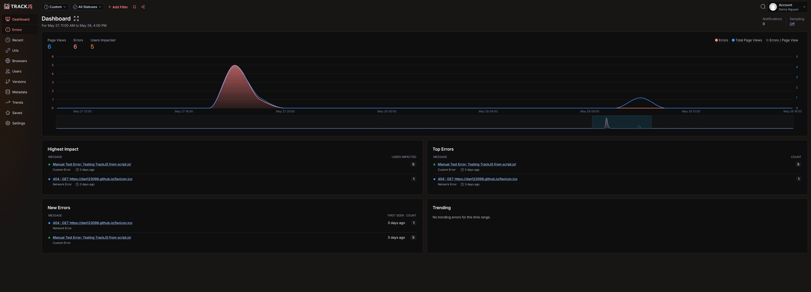

# Lab 9 - JavaScript Error Handling, Monitoring, & JS Docs

This repository contains the solution for Lab 9, focusing on JavaScript error handling and monitoring.

## Live Demo

You can view the live demo of this project hosted on GitHub Pages here:
[https://dan123098.github.io/Lab9_Starter/](https://dan123098.github.io/Lab9_Starter/)

## Features Implemented:

* **Console API Demos:** Buttons demonstrating various `console` methods (`log`, `error`, `count`, `warn`, `assert`, `clear`, `dir`, `dirxml`, `group`, `groupEnd`, `table`, `time`/`timeEnd`, `trace`).
* **Try/Catch/Finally:** An example integrated into the calculator to handle potential division by zero errors and other invalid inputs. It also includes a nested `try/catch` for demonstrating catching DOM-related errors.
* **Custom Errors:** A custom `DataValidationError` class is implemented, and a new button "Throw Custom Error" triggers its use.
* **Global Error Handling:** `window.onerror` is configured to catch and log uncaught JavaScript errors, demonstrated by the "Trigger a Global Error" button.
* **3rd Party Error Monitoring (TrackJS):** The project is set up to integrate with TrackJS. Errors triggered on the live demo are reported to the TrackJS dashboard.

## Screenshots

### TrackJS Error Reporting

Below is a screenshot from the TrackJS dashboard, showing errors triggered by this application being successfully captured.

